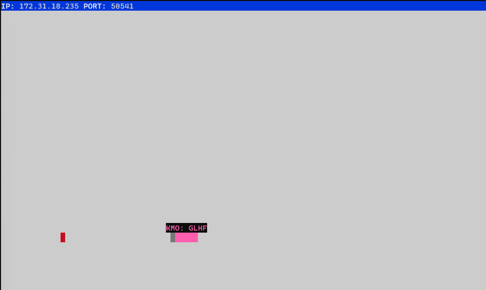

# Snake Client Project

Snake game is a very popular video game where the player maneuvers a dot, or snake, that grows by ‘eating’ pieces of food, or in this case, rectangles. As it moves and eats, the snake grows and the growing snake becomes an obstacle itself. The goal is help the snake grow as big as possible, but don't touch the sides, or the snake's tail! If your snake runs into the walls, or itself, your snake will die, and you will have to play again with a new, small snake.

The Snake Client Project is simply a multiplayer take on the snake game, with some sassy messages to shout at your opponent!

Before you can run this client, you will need to be running the server side which you can download and install from here. 

## Final Product

## Purpose
This project was created by [Kim O'Dell](https://github.com/kimodell), as part of the Lighthouse Labs Web Development Flex Program.

## Credits
This project was based on the game [Snek](https://github.com/taniarascia/snek) created by [Tania Rascia](https://github.com/taniarascia). The code for the Snake Client Project is a modified version of Tania's and was not written from scratch.

## Getting Started

- Follow steps inside the snek server repo to run the server side
- Run the development snake client using the `node play.js` command.

## Controls

- "W" - Move up
- "A - Move left
- "S" - Move down
- "D" - Move Right
- Use keys "E", "R", "F" and "G" to reveal a few sassy messages
- Use the `ctrl + c` command in the even of your snake's demise, followed by `node play.js` to try again. 